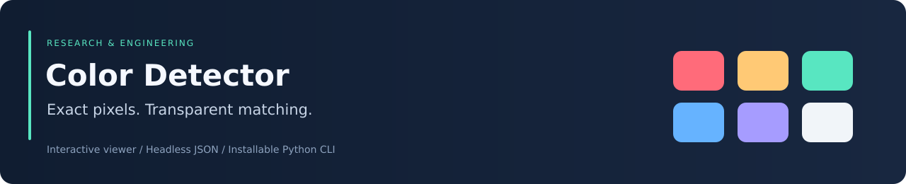

<div align="center">



# Color Detector

### Inspect original image pixels with a transparent, reproducible matching rule

[](https://github.com/Foysal-A-Al/Color_detection-using-python/actions/workflows/ci.yml)


[Overview](#overview) · [Installation](#installation) · [Usage](#usage) · [Matching](#color-matching) · [Validation](#validation)

</div>

## Overview

Color Detector is a small Python image-inspection utility with an interactive desktop viewer and a headless command-line interface. It reports a selected pixel's RGB value, hexadecimal representation, and nearest named palette color.

The implementation is deterministic and easy to inspect. It is suited to teaching image-coordinate conventions, testing RGB/BGR handling, inspecting visual assets, and building simple image-processing workflows. It uses a palette-distance calculation rather than a trained machine-learning model.

| Capability | Behavior |
|---|---|
| Interactive inspection | Double-click an image pixel; show the result in the viewer and terminal |
| Headless execution | Sample a coordinate and return machine-readable JSON |
| Exact sampled values | Original decoded-image RGB and hex values |
| Named-color lookup | Nearest entry in a configurable CSV palette |
| Source preservation | Annotations never modify the image used for sampling |
| Portable installation | Installable wheel and `color-detect` console command |

## Installation

**Requirements:** Python 3.10+; a graphical display for the interactive viewer.

```bash
git clone https://github.com/Foysal-A-Al/Color_detection-using-python.git
cd Color_detection-using-python
python -m venv .venv
```

| Platform | Activate the environment |
|---|---|
| Windows PowerShell | `.venv\Scripts\Activate.ps1` |
| Linux / macOS | `source .venv/bin/activate` |

```bash
python -m pip install -e ".[dev]"
```

This installs the desktop OpenCV backend and the `color-detect` command. The original `python color_detection.py ...` entry point remains supported.

<details>
<summary><strong>Headless server or CI installation</strong></summary>

In a separate environment:

```bash
python -m pip install "opencv-python-headless>=4.8,<5"
python -m pip install --no-deps .
```

Headless OpenCV supports pixel sampling but cannot display windows. Install one OpenCV backend per environment; installing both desktop and headless distributions creates overlapping `cv2` packages.

</details>

## Usage

### Desktop viewer

```bash
color-detect --image "path/to/photo.jpg"
```

Double-click a pixel to sample it. Press **Esc**, **Q**, or close the window to exit. The viewer draws the result on a separate display copy, so clicking an annotation still samples the original underlying image.

### Headless JSON output

```bash
color-detect --image "path/to/photo.jpg" --pixel 20 30
```

Coordinates are zero-based: X is the column, increasing rightward; Y is the row, increasing downward. No window is opened in this mode.

For a pure red pixel at `(20,30)`, the response is:

```json
{
  "x": 20,
  "y": 30,
  "rgb": [255, 0, 0],
  "hex": "#FF0000",
  "color_name": "Red",
  "palette_rgb": [255, 0, 0]
}
```

`rgb` and `hex` describe the sampled pixel; `palette_rgb` describes the named entry selected by the matching rule. Those values can differ for colors absent from the palette.

| Exit code | Meaning |
|---|---|
| `0` | Sampling completed or the viewer exited normally |
| `2` | Invalid arguments, unreadable image/palette, out-of-bounds coordinate, or handled display failure |

### Python API

```python
from color_detector import load_image, load_palette, sample_pixel

image = load_image("photo.png")
palette = load_palette("colors.csv")
result = sample_pixel(image, x=20, y=30, palette=palette)
print(result)
```

## Color matching

The bundled palette contains **16 basic colors**. For pixel $\mathbf p=(R,G,B)$ and palette entry $\mathbf c$, the selected name minimizes Manhattan distance:

$$D(\mathbf p,\mathbf c)=|R-R_c|+|G-G_c|+|B-B_c|.$$

Equal-distance ties select the **last** matching palette row, preserving the original implementation's convention.

OpenCV decodes images in BGR channel order; output is explicitly converted to RGB. Matching applies to decoded pixel values, without perceptual color-space conversion, ICC-profile analysis, or transparency analysis. A nearest basic-color name is not a calibrated colorimetric measurement.

## Custom palettes

```bash
color-detect --image photo.png --palette custom_colors.csv --pixel 10 10
```

Use a headerless, six-column CSV:

```csv
red,Red,#FF0000,255,0,0
blue,Blue,#0000FF,0,0,255
```

| Column | Requirement |
|---|---|
| Identifier | Entry identifier |
| Display name | Nonempty name returned in the result |
| Hex code | Must agree with the RGB values |
| R, G, B | Integers from 0 to 255 |

The default palette is independent of the working directory: a checkout uses its root `colors.csv`, while an installed wheel carries a bundled copy. When changing the bundled palette, keep [both source copies](color_detector/colors.csv) consistent. For application-specific naming, supply a custom palette explicitly.

## Implementation

| Module | Responsibility |
|---|---|
| [color_detector/detector.py](color_detector/detector.py) | Loading, validation, sampling, matching, annotation, and CLI |
| [color_detector/__init__.py](color_detector/__init__.py) | Public Python API |
| [color_detection.py](color_detection.py) | Compatibility script entry point |
| [colors.csv](colors.csv) | Editable checkout palette |
| [tests/test_detector.py](tests/test_detector.py) | Regression tests |

The module can be imported without opening a GUI or parsing command-line arguments. Interactive rendering and headless inference share the same sampling functions.

## Validation

```bash
python -m pytest -q
python -m build
```

The maintenance verification on **1 October 2026** passed **14 tests**, built wheel/source distributions, and exercised the installed CLI outside the checkout. CI runs Python 3.10 and 3.12 with headless OpenCV.

Tests cover channel order, JSON output, palette validation, tie-breaking, coordinate bounds, tiny images, working-directory independence, and preservation of original pixels. **Native desktop rendering still requires manual verification on a graphical system.**

The existing release workflow builds distributions on published GitHub releases. PyPI uploading requires separately configured trusted publishing; no registry publication was performed as part of this maintenance work.

## Contributing

Reproducible bug reports and focused improvements are welcome. Potential extensions include perceptual color-distance methods, image previews, and larger curated palettes; these are proposals, not implemented capabilities.

See [CONTRIBUTING.md](CONTRIBUTING.md) for development and verification guidelines. Maintained by [Abdullah Al Foysal](https://github.com/Foysal-A-Al).
